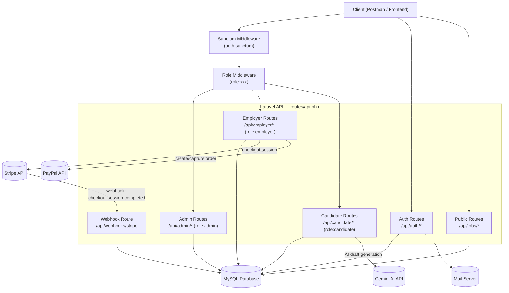
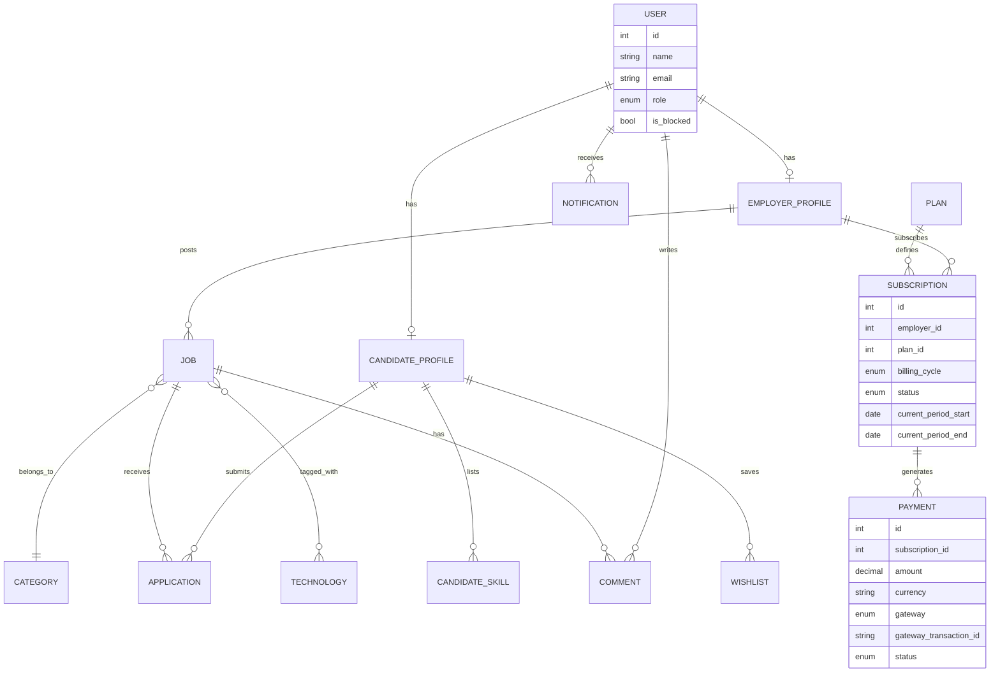
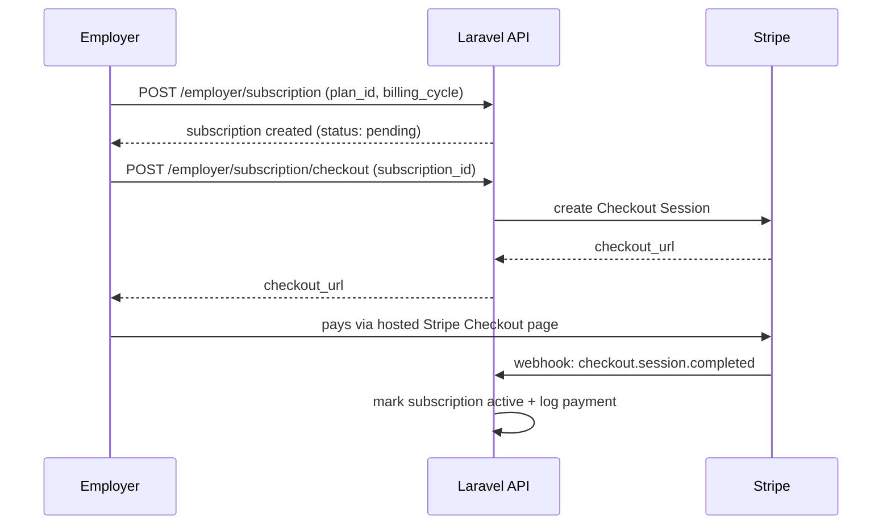
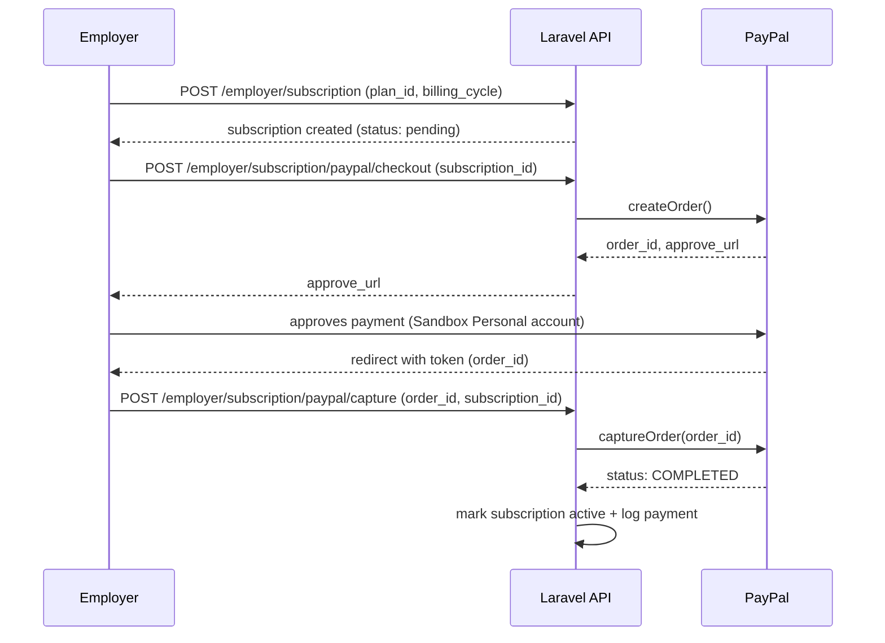

# Job Board Platform

A full-featured job board backend built with **Laravel**, supporting three user roles (Admin, Employer, Candidate), job posting and applications, paid employer subscriptions (**Stripe** & **PayPal**), notifications, comments, wishlists, AI-assisted features, and full **Feature test** coverage.

> Repository: [techmasterycompany-star/upwork_laravel](https://github.com/techmasterycompany-star/upwork_laravel)
> API Documentation (Postman): [View Collection](https://documenter.getpostman.com/view/57135921/2sBYAvwqZR)

---

## Table of Contents

- [Overview](#overview)
- [Tech Stack & Where It's Used](#tech-stack--where-its-used)
- [Architecture](#architecture)
- [Core Modules](#core-modules)
- [Payments: Stripe & PayPal Flow](#payments-stripe--paypal-flow)
- [Testing](#testing)
- [API Documentation](#api-documentation)
- [Getting Started](#getting-started)
- [Project Structure](#project-structure)

---

## Overview

The platform connects **Employers** who post jobs with **Candidates** who apply to them, moderated by an **Admin** role. Employers get 3 free job posts, after which they must subscribe to a paid plan (monthly/yearly) to keep posting — enforced through a subscription + payment system supporting two independent payment gateways.

---

## Tech Stack & Where It's Used

| Tool / Package | Purpose | Where It's Used |
|---|---|---|
| **Laravel** | Core PHP framework | Whole application — routing, Eloquent ORM, migrations, validation, queues |
| **Laravel Sanctum** | API token authentication | `auth:sanctum` middleware on all protected routes; token issued on register/login |
| **Custom Role Middleware** | Route-level authorization | Gates `/admin/*`, `/employer/*`, `/candidate/*` route groups by `role` column on `users` |
| **Stripe PHP SDK** | Card payments for subscriptions | `PaymentController::createCheckoutSession()` — Stripe Checkout Session + `StripeWebhookController` to confirm payment async |
| **Stripe CLI** | Local webhook forwarding (dev only) | `stripe listen --forward-to /api/webhooks/stripe` during local testing |
| **srmklive/laravel-paypal** | PayPal REST orders integration | `PaypalPaymentController` — `createOrder()` + `captureOrder()` for subscription payments |
| **MySQL** | Relational database | All persistent data — users, jobs, applications, subscriptions, payments, etc. |
| **Laravel Mail** | Transactional email | Email verification codes, password reset codes |
| **Laravel Socialite** | OAuth | LinkedIn login/profile import for candidates |
| **Gemini API** (via `Http::fake` in tests) | AI-assisted content generation | Job description generation, cover letter generation, career chatbot (bonus features) |
| **PHPUnit / Laravel Feature Tests** | Automated testing | Full Feature test suite per role/module (Auth, Admin, Employer, Candidate, Payments, Notifications, Comments, Wishlist, AI features) |
| **Git / GitHub** | Version control | 19 feature branches merged into `develop`, then `develop` → `main` |

---

## Architecture

### High-Level Request Flow



### Domain / Data Model



---

## Core Modules

| Module | Description |
|---|---|
| **Auth** | Register/login/logout, email verification via code, forgot/reset password, LinkedIn OAuth |
| **Admin** | Manage categories, technologies, approve/reject jobs, moderate comments, manage users, audit log, dashboard, manage plans |
| **Employer** | Company profile, job posting/lifecycle, application review, candidate search, subscriptions & payments |
| **Candidate** | Profile & skills, resume upload, job search, applications, wishlist, saved searches |
| **Comments** | Post/edit/delete/report comments on job listings |
| **Notifications** | In-app notification center for application, job approval, and payment events |
| **AI Features (Bonus)** | AI-generated job descriptions & cover letters, career chatbot |
| **Bonus Extras** | LinkedIn import, employer analytics, company branding |

---

## Payments: Stripe & PayPal Flow

Every subscription starts as **`pending`** and only flips to **`active`** once payment is actually confirmed — never on subscribe alone.

### Stripe (webhook-driven)



### PayPal (capture-driven)



---

## Testing

Full **Feature test** coverage across every module, using Laravel's testing framework with factories and `Http::fake()` for mocking external services (Gemini, Socialite):

| Test Suite | Coverage |
|---|---|
| `AuthTest` | Register, login, logout, email verification, password reset, LinkedIn OAuth (41 tests) |
| `AdminTest` | Categories, technologies, job approval, comment moderation, user management |
| `EmployerTest` | Profile, logo upload, job listings, free-job-limit/subscription gating, application review (41 tests) |
| `CandidateTest` | Profile, applications, public job search/listing (21 tests) |
| `WishlistTest` / `CommentTest` | 12 / 15 tests |
| `NotificationTest` | 10 tests |
| `AiFeaturesTest` / `EmployerAnalyticsTest` | AI generation (mocked) + analytics (16 + 6 tests) |

Run the full suite:

```bash
php artisan test
```

---

## API Documentation

Full API reference (all endpoints, request/response examples, auth headers) is available as a Postman collection:

**[📬 View Postman Documentation](https://documenter.getpostman.com/view/57135921/2sBYAvwqZR)**

---

## Getting Started

```bash
# 1. Install dependencies
composer install

# 2. Environment
cp .env.example .env
php artisan key:generate

# 3. Database
php artisan migrate --seed

# 4. Configure payment gateways in .env
STRIPE_KEY=pk_test_...
STRIPE_SECRET=sk_test_...
STRIPE_WEBHOOK_SECRET=whsec_...

PAYPAL_MODE=sandbox
PAYPAL_SANDBOX_CLIENT_ID=...
PAYPAL_SANDBOX_CLIENT_SECRET=...
PAYPAL_CURRENCY=USD

# 5. Serve
php artisan serve

# 6. (Local Stripe webhook testing)
stripe listen --forward-to http://127.0.0.1:8000/api/webhooks/stripe
```

---

## Project Structure

```
app/
├── Http/Controllers/Api/
│   ├── AuthController.php
│   ├── EmployerProfileController.php
│   ├── EmployerSubscriptionController.php
│   ├── PaymentController.php          # Stripe
│   ├── PaypalPaymentController.php    # PayPal
│   ├── StripeWebhookController.php
│   ├── JobListingController.php
│   ├── CandidateProfileController.php
│   └── Admin/                         # Admin-only controllers
├── Models/
│   ├── User.php
│   ├── EmployerProfile.php
│   ├── CandidateProfile.php
│   ├── Plan.php
│   ├── Subscription.php
│   └── Payment.php
database/
├── migrations/
routes/
└── api.php
tests/
└── Feature/
```